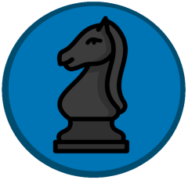

# ChessBot

 

**(Work in Progress)**

A discord Bot made with Python to play Chess with others on Discord.

---

### Authors:

-   [Guilherme](https://github.com/Guilherme-Vasconcelos)
-   [John Victor](https://github.com/johnvictofs)

#### Setup

- The bot requires Python 3.6 or higher to run

- Dependencies are present in the `pyproject.toml` file and can be easily installed with [`poetry`](https://github.com/sdispater/poetry) with `$ poetry install`

- Rename [`bot/orm/db_credentials.example.json`](bot/orm/db_credentials.example.json) to `db_credentials.json` and put in the database credentials for a Postgres database
    - Or, if you wish to use a Sqlite database, uncomment the `db = peewee.SqliteDatabase('bot.db')` line at [`bot/orm/models.py`](bot/orm/db.py)

- Rename [`bot/settings.example.json`](bot/settings.example.json) to `settings.json` and edit in the needed fields

    - You can create a discord bot and get its token at https://discordapp.com/developers/applications/  (Do not share your token with anyone!)

***

#### Running

- `$ python bot.py`

***
